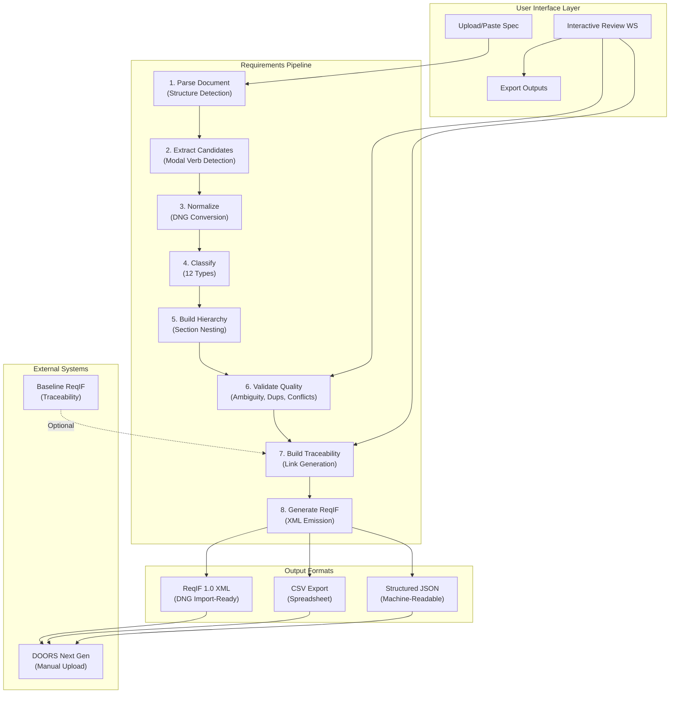
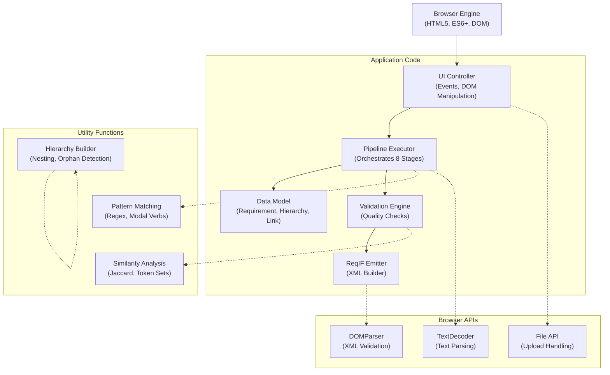
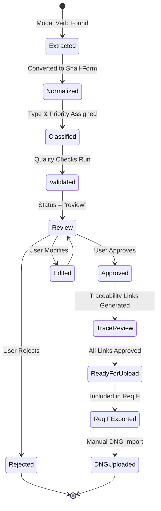
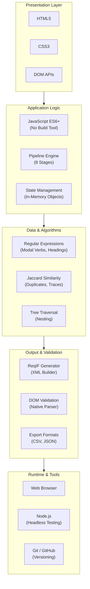
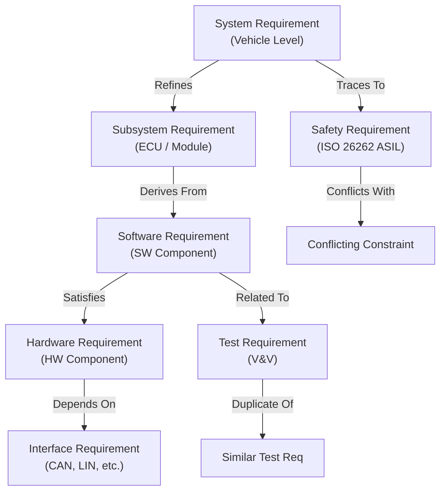

# ReqForge Component & Data Flow Diagrams

## High-Level System Architecture



## Detailed Pipeline Data Flow

```mermaid
graph LR
    RawText["Raw Text Input"] -->|parseDocument| DocStructure["Structured Doc<br/>{kind, heading, body, path}"]
    
    DocStructure -->|extractCandidates| Candidates["Requirement Candidates<br/>(Modal Verbs Found)"]
    
    Candidates -->|normalize| Normalized["DNG-Ready Reqs<br/>{text, title, original}"]
    
    Normalized -->|classify| Classified["Classified Reqs<br/>{type, typeConf, priority}"]
    
    Classified -->|buildHierarchy| Hierarchy["Hierarchical Tree<br/>(Sections + Reqs)"]
    
    Hierarchy -->|validate| Validated["Validated Reqs<br/>{flags, ready}"]
    
    Baseline["Baseline Reqs<br/>(Optional)"] -->|buildTraceability| Traces["Traceability Links<br/>{type, confidence}"]
    Validated --> Traces
    
    Traces -->|generateReqIF| ReqIF["ReqIF XML<br/>(OMG 1.0 Schema)"]
    
    ReqIF -->|validateReqIF| FinalOutput["Validated Output<br/>{valid, errors}"]
```



## Component Interaction Diagram



## Requirement Lifecycle State Machine



## Tech Stack Layers



## Automotive-Specific Traceability Links



---

## Single-File Deployment Model

```
index.html (single file ~3000 lines)
├── <meta charset, viewport, styles>
├── <HTML structure (container divs, form fields)>
├── <script type="module">
│   ├── parseDocument()
│   ├── extractCandidates()
│   ├── normalize()
│   ├── classify()
│   ├── buildHierarchy()
│   ├── validate()
│   ├── buildTraceability()
│   ├── generateReqIF()
│   ├── validateReqIF()
│   └── Event listeners (upload, review, export)
└── </script>
```

**No build step, no bundler, no external dependencies.**
Ship to production as-is.
Works offline. Runs in any modern browser.

